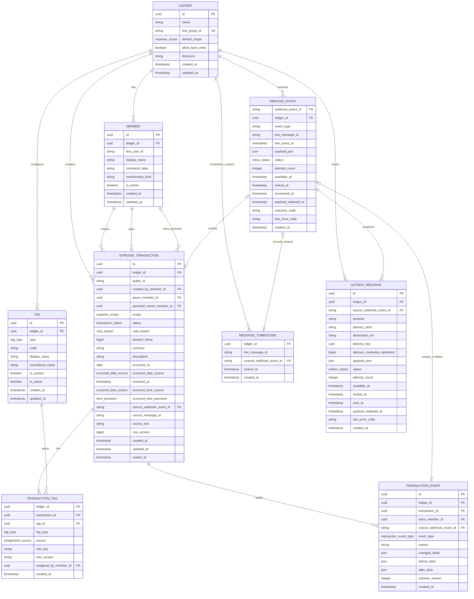

# 資料模型

## 設計原則

- 一筆支出永遠屬於一個帳本（`ledger`）；所有關聯都由資料庫保證不能跨帳本。
- `scope` 是支出的帳務範圍，不是標籤。它使用獨立 enum：`shared` 或 `personal`。
- 帳本允許裸格式，`牛肉麵 150` 使用帳本目前的 `default_scope`；初始為 `personal`，可由兩位成員在 LINE 切換，明確 scope 前綴只覆蓋該筆。
- 建立者、付款人與個人支出的所有人是三個不同概念。改付款人不會連動改所有人。
- personal transaction 雖仍實體隸屬建立當下的 ledger，其邏輯帳戶以 owner 的 `line_user_id` 辨識；查詢可安全聚合同一 user 在私訊、目前或歷史 ledger 中的個人資料。
- 分類、餐別與情境標籤共用 `tag`／`transaction_tag`，但由 `tag_type` 保留型別：每筆交易恰好一個分類、至多一個餐別、至多十個 custom/context tags。
- `occurred_on` 永遠有值；精確時間可以未知。不能用訊息送出時間假裝成補登支出的發生時間。
- 使用者取消是可還原的 soft void。LINE 收回原始新增訊息是隱私刪除：刪除該筆業務交易、標籤關聯與稽核資料，只留下不含訊息內容的 message tombstone。
- webhook 採 transactional inbox，LINE 回覆採 transactional outbox。DB 的業務異動、audit、outbox enqueue 與 inbox 完成狀態必須在同一個 transaction 內提交。
- `webhookEventId` 是事件冪等鍵；LINE message ID 是訊息／收回關聯鍵。兩者用途不同，不能互相取代。

> PostgreSQL 實體表建議命名為 `expense_transaction`，不要使用保留字 `transaction`。

## 關聯



## 主要資料表

### `ledger`

- 群組 ledger 的 `line_group_id` 保存 LINE group ID；獨立個人 ledger 使用內部 `user:{line_user_id}` route key。兩者都必須全域唯一。
- `default_scope expense_scope NOT NULL DEFAULT 'personal'`；此欄位同時是群組目前的持久記帳模式。
- `allow_bare_entry BOOLEAN NOT NULL DEFAULT true`。
- `timezone TEXT NOT NULL DEFAULT 'Asia/Taipei'`；日期界線、相對日期與餐別判定都讀這個值，不能讀 DB server timezone。
- provisioning 必須明確寫入 `default_scope = 'personal'`、`allow_bare_entry = true`。

`default_scope` 只是裸格式的預設。交易落庫時仍要把解析後的 scope 寫進 `expense_transaction.scope`，避免日後改帳本預設時改變舊資料的意義。

### `member`

- `(ledger_id, line_user_id)` 唯一。
- `membership_kind` 只能是 `personal` 或 `couple`。同一 `line_user_id` 同時至多一個 active personal membership 與一個 active couple membership。
- personal member 必須屬於自己的 `user:{line_user_id}` ledger；couple member 屬於 LINE 群組 ledger。私訊有 personal membership 時永遠優先路由 personal ledger。
- `line_user_id` 是個人歷史與暱稱的邏輯 identity key。當個人查詢跨 ledger 聚合時，必須用 personal owner member 的 `line_user_id` 授權，不可用目前 ledger membership 推測所有權。
- `display_name` 同步至同一 `line_user_id` 的 memberships；`command_alias` 只對 active memberships 使用，且仍受每 ledger active unique 約束。
- `(ledger_id, command_alias)` 在 active member 中唯一，建議以正規化後字串建立 partial unique index。
- `(ledger_id, id)` 另建唯一鍵，供所有帶 `ledger_id` 的複合外鍵引用。
- `is_active = false` 只阻止未來操作，不改變舊交易的建立者、付款人或所有人。

### `tag`

`tag.type` 使用 `tag_type`：

- `category`：消費主分類，例如食物、交通、娛樂、居家、購物、醫療健康、旅遊、未分類。
- `meal`：早餐、午餐、下午茶、晚餐、宵夜。
- `custom`：使用者自訂，例如約會、台南、紀念日；也可由 migration 建立受保護的 system context tag，例如 `native_family / 原生家庭`。

必要索引與生命週期：

1. `(ledger_id, id, type)` 唯一，讓 `transaction_tag` 可用複合外鍵同時驗證 ledger 與型別。
2. `(ledger_id, type, code)` 唯一；`code` 是不隨改名變動的穩定代碼。
3. `(ledger_id, normalized_name)` 在 active tag 中跨所有型別唯一。這既避免 `約會` 的空白／大小寫變體，也禁止 custom tag 冒用 `食物`、`午餐`等 category／meal 保留名稱。
4. MVP 不提供 category／meal tag 的新增、改名或刪除；這些系統 tag 由 migration seed，且不可停用。`is_active` 是未來版本的保留欄位。
5. 一般 custom tag 在第一次有效 `#標籤` 輸入時 lazy create；system context tag 由 migration 建立且可由保守規則以 `source=inferred`指派。DB trigger 禁止 inferred custom assignment 指向一般使用者 tag。
6. custom tag 的 `display_name` 必須是 1–20 個 Unicode 字元且不含空白或 `#`；正規化規則必須版本固定並在寫入前執行。

### `expense_transaction`

`expense_transaction` 只保存核心支出資料；分類、餐別與自訂標籤不再直接存在這張表。

- `public_id` 是供人輸入的 opaque ID。使用至少 8 個不易混淆的隨機 Base32 字元，並建立全域唯一索引；碰撞時重新產生。全域唯一是為了讓使用者跨聊天視窗安全指定自己的交易，不代表 public ID 具有授權能力。
- `scope` 必填，且只能為 `shared` 或 `personal`。
- `created_by_member_id`、`payer_member_id` 必填；`personal_owner_member_id` 依 scope 決定是否必填。
- `amount_minor > 0`；MVP `currency = 'TWD'`。一律用整數最小貨幣單位，不使用 float。
- `description` 是業務項目；`source_text` 是原始新增訊息，可為空，且不得複製到一般 log。
- `(ledger_id, source_message_id)` 唯一，保證同一個 LINE 文字訊息最多建立一筆交易。
- `(ledger_id, source_webhook_event_id)` 唯一，並複合外鍵到 inbox event。
- `(ledger_id, id)` 另建唯一鍵，供 tag／audit 使用同 ledger 複合外鍵。
- `row_version` 從 1 開始，每次有效異動加 1，供 optimistic concurrency control；執行 mutation 時仍要鎖定資料列。

scope／owner 約束：

```text
scope = personal -> personal_owner_member_id IS NOT NULL
scope = shared   -> personal_owner_member_id IS NULL
```

付款人可以和 owner 不同。修改 `payer_member_id` 不得連帶修改 `personal_owner_member_id`。

### `transaction_tag`

這是 typed multi-tag 關聯表。每一列都保存當次標記的來源與可重現規則：

- `source`：`explicit` 或 `inferred`。
- `rule_key`：穩定的規則識別，例如 `parser:user_hashtag`、`category:food.noodle`、`meal:dinner.window`。
- `rule_version`：產生該判斷的 parser／分類器／餐別規則版本。
- `assigned_by_member_id`：使用者明確指定時必填；自動推定時為空。

`rule_key` 與 `rule_version` 對 explicit 與 inferred 都必填。如此明確輸入 `#娛樂` 也能知道是由哪版 parser 解讀，而不是把「explicit」誤當成沒有 provenance。

DB 約束：

1. 主鍵為 `(ledger_id, transaction_id, tag_id)`，同一標籤不可重複貼在同一交易。
2. `(ledger_id, transaction_id, tag_type)` 的 category partial unique index，保證「至多一個 category」。
3. `(ledger_id, transaction_id, tag_type)` 的 meal partial unique index，保證「至多一個 meal」。
4. PostgreSQL deferred constraint trigger 在 transaction 結束前驗證每筆交易「恰好一個 category」。建立交易與 category tag 必須放在同一 DB transaction；分類失敗時貼 `category:uncategorized`。
5. deferred constraint trigger 驗證 meal tag 只能與 `category:food` 共存。
6. 一般使用者 `tag_type = custom`只能是 `source = explicit`；受 migration 保護的 system context tag 可為 inferred，且必須由 DB trigger 驗證目標 tag 的 `is_system`與 active 狀態。category 與 meal 可以 explicit 或 inferred。
7. `source = explicit` 時 `assigned_by_member_id` 必填；`source = inferred` 時必須為空。
8. `(ledger_id, tag_id, tag_type)` 複合外鍵到 `tag`，避免把 category tag 偽裝成 meal tag 來繞過唯一限制。
9. deferred constraint trigger 驗證每筆交易最多 10 個 custom tag；重複輸入因主鍵只保存一次。

因此一筆交易可以是：

```text
scope: shared
tags:
  - category:food       inferred / category:food.noodle / v3
  - meal:lunch          inferred / meal:lunch.window / v2
  - custom:date-night   explicit / parser:user_hashtag / v1
  - custom:taipei       explicit / parser:user_hashtag / v1
```

不同 tag 維度會重疊；報表可各自篩選，但不能把「食物小計＋午餐小計＋約會小計」相加當成總支出。

### `transaction_event`

所有 Create／Update／soft Delete／Restore 使用同一組事件名稱：

- `created`
- `updated`
- `voided`
- `restored`

分類、餐別、scope、付款人或文字的修改都使用 `updated`，並在 `changed_fields` 指出欄位；不另用 `category_changed`。取消一律使用 `voided`，不使用 `void`。這消除規格與驗收名稱不一致。

- `(ledger_id, source_webhook_event_id)` 唯一，確保同一 LINE 指令不會建立第二筆 mutation audit。
- `before_data`／`after_data` 保存版本化業務快照，包括 typed tag assignment 與其 provenance，但不得保存 `source_text`、LINE 原始 payload、reply token 或 secret。
- `schema_version` 必填，避免日後欄位變動後無法解讀舊 JSON。
- user command 的 `actor_member_id` 必填；可信任的 migration／repair 可為空，但必須另有 reason。
- FK 對 `expense_transaction` 使用 `ON DELETE CASCADE`，讓原始新增訊息被 LINE 收回時可以完整清除該交易的 audit 副本。

### `inbound_event`：transactional inbox

簽章驗證通過後，把每個 LINE event 正規化並先寫入 inbox：

- `webhook_event_id` 是全域唯一主鍵；重送使用 `INSERT ... ON CONFLICT DO NOTHING`。
- `(ledger_id, webhook_event_id)` 另建唯一鍵，供 business／audit／outbox 使用同 ledger 複合外鍵。
- `line_message_id` 對文字事件是本身 message ID，對 unsend event 是被收回的 message ID。
- `payload_json` 只保存重試處理所需的最小 payload；不保存整包 HTTP request。可辨識文字在收到 unsend 後必須設為空並寫 `payload_redacted_at`。
- LINE edit event 不保存編輯後文字，只保存阻止它再次造成副作用所需的 event／message metadata。
- `status`：`pending`、`processing`、`succeeded`、`dead_letter`。
- `attempt_count`、`available_at`、`locked_at` 支援 lease、退避與 crash recovery；`last_error_code` 只存可診斷代碼，不存完整訊息內容或 secret。
- `outcome_code` 區分 `applied`、`noop`、`ignored_unsent`、`unauthorized`、`rejected` 等已完成結果。被忽略不等於處理失敗。

HTTP endpoint 只在 inbox insert transaction 成功提交後回 2xx。業務 worker 用 `FOR UPDATE SKIP LOCKED` claim event；逾時的 `processing` lease 可回到 `pending`，不會永久卡住。

### `outbox_message`：transactional outbox

業務結果與待送 LINE 回覆要在同一 DB transaction 建立：

- `(ledger_id, source_webhook_event_id, purpose)` 唯一，避免 webhook 重送 enqueue 第二則相同用途的回覆。
- `delivery_key` 建立後固定不變；LINE API 支援 provider retry key 的 delivery path 必須重用同一 key。
- `status`：`pending`、`sending`、`sent`、`dead_letter`。
- `attempt_count`、`available_at`、`locked_at` 支援退避與 crash recovery。
- reply token 等 delivery credential 必須加密保存並設短期 retention；不得出現在 log 或 audit。
- 已送達且超過除錯保留期的 `payload_json` 應清除。若 payload 引用了被收回原始訊息的文字，unsend cleanup 必須立即清除，不等 retention job。

DB outbox 保證「一個業務結果只有一個 logical delivery job」且不會因 process crash 遺失 enqueue。若 provider API 本身不支援 idempotency，網路逾時後仍只能提供 at-least-once delivery；文件與監控不得宣稱外部 exactly-once。

MVP 的確認回覆只在原 reply token 仍有效時做 bounded retry；token 過期後進 `dead_letter` 並告警，不自動建立 push fallback。帳務副作用仍維持 exactly-once／業務冪等，產品接受極少數「帳已成功但確認未送達」，由 `最近`查詢核對。

清除 DB 中的 outbox payload 不等於能撤回已送進 LINE 群組的確認訊息；已送訊息可能仍可見，產品不得承諾可遠端移除。

### `message_tombstone`

`message_tombstone` 只用於記住 LINE message ID 已被收回：

- 主鍵／唯一鍵：`(ledger_id, line_message_id)`。
- `unsend_webhook_event_id` 複合外鍵到該帳本的 inbox event，且唯一。
- 只保存 message ID、unsend event ID、LINE unsend 時間與建立時間，不保存原始文字、description、金額、tag 或 audit snapshot。
- tombstone 保留期不得短於最長備份保留期。

建立任何由 LINE message 觸發的業務動作前，原 message handler 與 unsend handler 都必須先取得同一個由 `(ledger_id, line_message_id)` 導出的 transaction-scoped PostgreSQL advisory lock，再檢查／upsert tombstone 及建立／刪除交易。單純「查詢是否已有 tombstone」不足以處理兩事件並行。共用 lock 使其中一方完成後另一方才繼續：unsend 先完成則 message 得到 `ignored_unsent`；message 先完成則 unsend 接著完整 purge。

### Durable deletion journal（主要 DB 之外）

只把 tombstone 放在主要 DB，無法防止從早於 unsend 的舊備份還原後讓交易復活。因此 production 必須另有與主要 DB recovery unit 分離的 append-only deletion journal：

- journal entry 只保存 ledger stable ID、LINE message ID、unsend event ID、unsent at 與 journal sequence，不保存品項、金額、標籤或成員資料。
- `(ledger stable ID, line message ID)` 是冪等鍵。
- unsend worker 必須先成功 append journal，再提交主要 DB 的 tombstone 與 purge；journal 成功但 DB 失敗是安全的，重試會完成 purge。journal append 失敗時不得把 unsend inbox 標成 succeeded。
- journal 使用獨立備援與加密，保留期不得短於最長 DB 備份保留期。
- 從任何 DB 備份還原後，application 接受流量前必須重放 journal，對每個 entry 建立 tombstone 並 purge 對應 message 的業務資料。

## 日期與時間模型

日期與時間分開保存：

- `occurred_on DATE NOT NULL`：帳本 timezone 下的業務日期。
- `occurred_date_source`：`line_event`、`relative_input`、`absolute_input`、`manual_update`。
- `occurred_at TIMESTAMPTZ NULL`：只有知道發生時間時才保存的絕對時間，DB 以 UTC 表示。
- `occurred_time_source`：`line_event`、`explicit_input`、`manual_update`；時間未知時為空。
- `occurred_time_precision`：`unknown`、`minute`、`millisecond`。

必要約束：

```text
occurred_at IS NULL
  <-> occurred_time_source IS NULL
  <-> occurred_time_precision = unknown

occurred_at IS NOT NULL
  <-> occurred_time_source IS NOT NULL
  <-> occurred_time_precision IN (minute, millisecond)
```

若 `occurred_at` 有值，deferred constraint trigger 必須驗證：

```text
occurred_on = date(occurred_at AT TIME ZONE ledger.timezone)
```

輸入對應：

| 輸入 | `occurred_on` | `occurred_at` | 時間來源／精度 | 自動餐別 |
|---|---|---|---|---|
| `牛肉麵 150` | LINE event 的帳本當地日 | LINE event timestamp | `line_event`／`millisecond` | 符合餐點規則時可推定 |
| `昨天 牛肉麵 150` | LINE event 當地日減一天 | `null` | `null`／`unknown` | 不推定 |
| `昨天 19:30 牛肉麵 150` | LINE event 當地日減一天 | 該日當地 19:30 換算 UTC | `explicit_input`／`minute` | 符合餐點規則時可推定 |
| `2026-08-12 牛肉麵 150` | 2026-08-12 | `null` | `null`／`unknown` | 不推定 |
| `2026-08-12 晚餐 牛肉麵 150` | 2026-08-12 | `null` | `null`／`unknown` | 可貼 explicit 晚餐 tag |

只有日期的補登不沿用訊息送出時分，也不虛構中午或晚上。meal tag 的 inferred assignment 必須同時滿足：

1. category 是 food；
2. `occurred_at` 有值；
3. 項目被餐點 eligibility rule 判定為正餐型內容；咖啡、單純飲料不因時間落在中午就自動成為午餐；
4. 時間落在規則版本定義的明確區間。

明確輸入的 meal tag 不需要 `occurred_at`，但仍必須與 food category 共存。所有 inferred meal assignment 都在 `transaction_tag.rule_key`／`rule_version` 保存 eligibility 與時間窗規則版本。

若使用者輸入明確 meal 但沒有明確 category，parser 必須同時建立 explicit food category assignment，規則可記為 `parser:meal_implies_food`。若使用者同時明確指定非 food category，整個 command 在進入 mutation 前拒絕。`晚餐 200` 的 description 仍保存為「晚餐」，並建立 explicit food 與 explicit dinner；不能因抽取 meal modifier 而留下空 description。

`改 #編號 日期 ...` 只改當地日期：若原交易有精確時間，保留原本當地時分並用新日期重建 `occurred_at`，將 date／time source 記為 `manual_update`；原本時間未知則保持 `occurred_at = null`。`改 #編號 時間 未知` 會清空 `occurred_at`／`occurred_time_source`，把 precision 設為 `unknown`，並移除 inferred meal tag。日期或時間異動後都重新計算 inferred meal；explicit meal 保持不變。

## 權限與 mutation 約束

查詢授權與 mutation 權限使用同一邊界。這是 application data access boundary，不是 LINE 群組顯示層的私密訊息機制：

- `scope = shared`：只有 actor 目前 active couple ledger 的任一 active member 可查看、修改、取消或還原。
- `scope = personal`：只有 owner member 的 `line_user_id` 與 actor 相同時可查看、修改、取消或還原；付款人或同一群組的對方都沒有 owner 權限。
- 新增 personal 交易時 owner 預設為 actor 本人。若日後新增可替另一人建個人帳的語法，仍須明確保存 owner，不得由 payer 反推。
- shared 改 personal 時 owner 設為 actor；personal 改 shared 只有原 owner 可執行，轉換後清空 owner。
- personal owner 可以用明確的「改所有人」指令轉給同帳本另一位 active member；只有目前 owner 可執行。成功後新 owner 立即取得 mutation 權限，原 owner 立即失去權限。
- 修改付款人不修改 owner；owner 只可透過明確的「改所有人」欄位操作，不得因修改 payer 或 scope 以外的欄位而暗中連動。

這些規則不能只靠 LINE UI。建議讓 application DB role 不具有資料表直接 `UPDATE`／`DELETE` 權限，只能呼叫帶 `actor_member_id` 的 mutation function；function 鎖定交易後同時檢查 ledger membership、active 狀態、scope／owner、目前 status 與 row version，再寫交易、audit、outbox。若不用 stored function，至少要用同一 DB transaction 的 repository guard 加整合測試，並以 RLS 作第二層防護。

無效或無權 mutation 必須原子失敗：不改交易、不改 tag、不建立 `transaction_event`；可以建立不含敏感資料的拒絕 outbox 回覆，並把 inbox 標成已處理。

## 取消、還原與 LINE 收回

### 一般取消／還原

一般 `取消 #編號` 是 soft void：

```text
active --取消--> voided
voided + void_reason=user_cancel --還原--> active
```

約束：

1. `status = 'active'` 時 `void_reason`、`voided_at` 都為空。
2. `status = 'voided'` 時 `void_reason = 'user_cancel'` 且 `voided_at` 必填。
3. 取消建立 `transaction_event.event_type = 'voided'`；還原建立 `restored`。
4. 同狀態重複取消／還原是 `noop`，不建立第二筆 audit event。
5. 一般列表與統計只讀 `status = 'active'`；單筆查詢可顯示 voided 資料。

### LINE unsend 特例

LINE 收回不是 soft void，也不是 restore-able 狀態：

1. 先在同一 DB transaction upsert `(ledger_id, line_message_id)` tombstone。
2. 若被收回的是原始新增訊息，依 `(ledger_id, source_message_id)` 找出交易，實體刪除 `expense_transaction`；FK cascade 同步刪除其 `transaction_tag` 與全部 `transaction_event`。不得留下「已收回」description、`void_reason = line_unsend` 或 `unsent` audit event。若該交易曾 lazy-create 的 custom tag 已沒有任何其他交易引用，也一併刪除該 orphan custom tag；仍被其他交易使用的同名 tag 則保留。
3. 清除原 message inbox 的 `payload_json`／可辨識文字，以及引用該文字的未送或已送 outbox payload；只保留處理狀態與非內容 metadata。
4. 若被收回的是修改、取消或還原指令，不反轉已提交的業務結果；只清除該指令的 inbox／outbox 文字副本。audit 本身不保存原始指令文字，因此仍可保留業務異動紀錄。
5. 若尚未收到原 message，tombstone 仍先提交；之後原 message event 只能標成 `ignored_unsent`。
6. 收回流程可以安全重送：tombstone upsert、找不到已刪交易及重複 payload redaction 都是 idempotent。

這個設計把「使用者取消一筆仍應稽核的帳」與「使用者要求 LINE 內容消失」分開，避免用同一個 `void_reason` 表達兩種相反的資料保留政策。

## Inbox／業務／Outbox 原子流程

1. 對原始 request bytes 驗證 LINE webhook signature；失敗時不 JSON parse、也不寫 inbox。
2. 簽章通過後解析 routing metadata，所有群組事件先檢查設定的 group ID。文字 CRUD 等使用者操作再檢查 active member user ID；join／unsend 等不保證帶 user ID 的群組事件不得因缺少 user ID 而被拒絕。未授權事件若需去重，只保存 event ID、時間、`outcome_code = unauthorized` 等非內容 metadata，`payload_json` 必須為空；不得短暫落庫訊息文字。
3. 對每個已授權 event 以 `webhookEventId` insert inbox；衝突代表已可靠接收，直接視為成功。
4. inbox commit 後才回 HTTP 2xx。
5. worker claim 一筆 pending event 並開啟 DB transaction。
6. 對有 message ID 的 event 先取得共用 advisory lock 並檢查 message tombstone；再依事件型別檢查 ledger membership、目標交易 scope／owner 權限，執行 create／read／update／void／restore／unsend。
7. mutation、typed tags、audit、outbox enqueue、`inbound_event.status = succeeded` 在同一次 commit 完成。
8. process 在 commit 前 crash：整批 rollback，lease 到期後重試。commit 後 crash：inbox 已是 succeeded，不會重做業務異動。
9. outbox worker 獨立 claim 與傳送；失敗依 `available_at` 退避重試，超過政策門檻進 `dead_letter` 並告警。

額外冪等防線：

- `expense_transaction (ledger_id, source_message_id)` unique：同一新增訊息至多一筆交易。
- `expense_transaction (ledger_id, source_webhook_event_id)` unique：同一 create event 至多一筆交易。
- `transaction_event (ledger_id, source_webhook_event_id)` unique：同一 mutation event 至多一筆 audit。
- `outbox_message (ledger_id, source_webhook_event_id, purpose)` unique：同一事件同一用途至多一個 logical reply。
- state transition guard：不同 webhook event 的重複取消／還原仍只得到 noop，不新增 audit。

`最近 5`、`本月 共同` 等查詢指令必須在新增支出解析前完整匹配；Read command 不會進入 create use case，因此尾端數字不會被誤認為金額。

## 跨帳本完整性

UUID 主鍵全域唯一仍不足以證明關聯屬於同一帳本。下列關聯一律使用含 `ledger_id` 的 composite foreign key（或等價 constraint trigger），不能只靠 application 查詢：

- transaction 的 creator、payer、personal owner → `member (ledger_id, id)`。
- transaction 的 source event → `inbound_event (ledger_id, webhook_event_id)`。
- transaction tag 的 transaction → `expense_transaction (ledger_id, id)`。
- transaction tag 的 tag／type → `tag (ledger_id, id, type)`。
- transaction tag 的 assigned by → `member (ledger_id, id)`。
- transaction event 的 transaction、actor、source event → 各自同 ledger 複合鍵。
- message tombstone 的 unsend event → 同 ledger inbox event。
- outbox 的 source event → 同 ledger inbox event。

public ID 解析必須在同一個 SQL predicate 內同時驗證全域唯一 `public_id` 與可見邊界：personal owner 的 `line_user_id = actor` 或 shared transaction 屬於 actor 目前 active couple ledger。不可先讀出交易內容再做授權。不存在、對方個人帳、舊配對共同帳與其他 ledger 一律回相同的 not-found。

## 列舉值

- `expense_scope`：`shared`、`personal`。
- `tag_type`：`category`、`meal`、`custom`。
- `assignment_source`：`explicit`、`inferred`。
- `transaction_status`：`active`、`voided`。
- `void_reason`：`user_cancel`。LINE unsend 不進入此 enum，因為其交易會被刪除。
- `occurred_date_source`：`line_event`、`relative_input`、`absolute_input`、`manual_update`。
- `occurred_time_source`：`line_event`、`explicit_input`、`manual_update`；時間未知時為 `null`。
- `time_precision`：`unknown`、`minute`、`millisecond`。
- `transaction_event_type`：`created`、`updated`、`voided`、`restored`。
- `inbox_status`：`pending`、`processing`、`succeeded`、`dead_letter`。
- `outbox_status`：`pending`、`sending`、`sent`、`dead_letter`。

## 從第一個 migration 就必須存在的約束

以下不是後續最佳化，必須和最小可寫入版本一起上線：

1. ledger timezone 與目前的個人／共同裸格式模式。
2. member 授權與 personal owner mutation guard。
3. 所有同 ledger 複合外鍵。
4. amount／currency／scope／owner／status 的 check constraint。
5. 每筆交易恰一 category、至多一 meal 的 unique index 與 deferred constraint trigger。
6. tag assignment 的 source、rule、version provenance。
7. occurred_on 必填與 nullable occurred_at 的一致性約束。
8. inbox、outbox、source message、source event 的 idempotency unique keys。
9. unsend tombstone、hard purge 與 payload redaction 路徑。
10. 至少 8 字元、全域唯一 public ID，並在 lookup 同時驗證 user-scoped personal／current-couple shared 可見邊界。

分類器規則也要從第一版保存穩定 `rule_key` 與版本，並使用具邊界或最長詞優先的規則。例如 `飯店` 應先命中旅遊規則，不能因包含單字 `飯` 就被分成食物；規則調整後既有交易仍可由 assignment provenance 解釋。

## 為未來預留但 MVP 不建立的表

如果之後要做「誰欠誰」，新增 `transaction_split`，每位參與者各有固定金額或比例。不要把分攤資料塞進 `expense_transaction` 的 JSON 欄位；關聯表才能可靠查詢、限制同 ledger，並驗證分攤總和等於交易金額。
