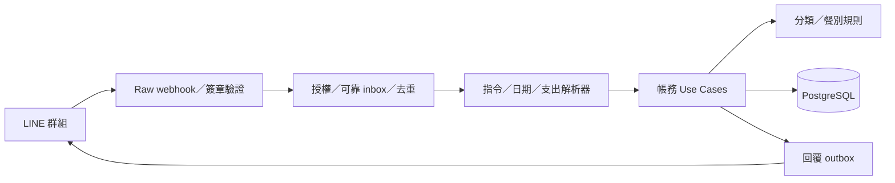

# 實作計畫

本計畫依 [產品規格](spec.md)、[資料模型](data-model.md) 與 [驗收案例](acceptance.md) 實作。需求改變時先修改規格與案例，讓測試表達新行為，再調整程式。

## 1. 建議技術邊界

- Runtime：TypeScript + Node.js。
- LINE：Messaging API webhook 與官方 SDK。
- Database：PostgreSQL。
- 測試：純函式單元測試、repository 整合測試、webhook 契約測試及少量端對端測試。
- 部署：可提供公開 HTTPS、持久化 secret、受管 PostgreSQL 與背景工作程序的服務。

LINE handler 只負責驗證、將 event 安全寫入 inbox 與送出既定回覆。解析、權限、標籤與帳務 use case 不依賴 LINE SDK，才能用固定 event time 做可重現測試。

## 2. 階段 0 — 專案骨架與資料庫

- 建立 TypeScript 專案、設定驗證、lint、test 與 migration 流程。
- 建立所有 enum、表、index、foreign key、check／trigger 與 seed。
- 從第一個 migration 使用 `timestamptz`，消費日期另用 `date`。
- seed 單一帳本、兩位成員、固定大分類與餐別標籤。
- 實作公開交易編號生成、唯一約束與碰撞重試。
- 建立 repository 整合測試，特別驗證 scope／owner、typed tag 及跨帳本完整性。

完成條件：空資料庫可一鍵 migration／seed，所有 DB 約束測試通過。

## 3. 階段 1 — 安全且可靠地接收 LINE event

- 取得 raw request bytes 後驗證 LINE 簽章，再做 JSON parse。
- 所有群組事件驗證 group ID；文字 CRUD 再驗證兩位 user ID allowlist。join／unsend 不因缺少 user ID 而被拒絕；未授權事件不保存文字。
- 實作 durable inbox 狀態、lease／retry、錯誤資訊與 `webhookEventId` 去重。
- inbox state 與帳務 mutation 使用同一 DB transaction 或等價的可恢復設計。
- 實作 reply outbox／結果狀態，涵蓋 DB 成功但 LINE timeout；只在 reply token 有效期內 bounded retry，過期後告警且不自動 push 補送。
- 支援一個 request 含多個 events、空 events、非文字與錯誤群組。
- 加入 request body limit、敏感資訊遮罩與結構化日誌。

完成條件：簽章、授權、重送、當機恢復與回覆失敗案例全部通過，且不會重複副作用。

## 4. 階段 2 — Create 與 typed multi-tag

- 實作 parser dispatch，保留指令優先於裸格式支出。
- 實作金額尾碼、共同／個人、相對／絕對日期、精確／未知時間及 hashtag 解析。
- 一則訊息最多建立一筆交易；格式錯誤回覆可操作提示。
- 實作有版本的分類規則：最長詞優先，再依 priority，衝突則未分類。
- 實作正餐 eligibility 與保守餐別時間窗；咖啡、飲料、甜點、點心不自動標記。
- 建立一個大分類、零或一個餐別、零到十個自訂標籤。
- 實作 shared／personal 建立權限及成功確認回覆。

完成條件：產品規格第 4–7 節的 Create 情境與所有邊界測試通過。

## 5. 階段 3 — Read 與摘要

- 實作 `查 #ID`，可查看 active 與 voided。
- 實作 `最近 [N]`，按建立時間倒序並限制 1–20。
- 實作今天、昨天、本週、上週、本月、上月、scope 與 hashtag 篩選。
- 實作項目關鍵字搜尋、分類排行與常用指令別名。
- `本月`同時回傳唯一交易總額、共同小計、兩位個人小計及大分類小計。
- 使用 Asia/Taipei 半開時間／日期區間，正確處理月界線。
- 明確標示自訂標籤統計可重疊，不能直接相加。

完成條件：所有單筆、排序、日期範圍、權限與重疊標籤摘要案例通過。

## 6. 階段 4 — Update、Delete 與稽核

- 實作一次一欄位的修改 parser 與原子 use case。
- 支援項目、金額、大分類、自動分類、餐別、自動／無餐別、scope、付款人、所有人、日期與時間。
- 支援批次新增／移除自訂標籤；整個指令成功或失敗，不做部分更新。
- 修改項目、分類、日期與時間時依規格更新自動標籤，不覆蓋合法的明確標籤。
- 實作共同交易兩人可改、個人交易僅 owner 可改的權限。
- 實作 soft cancel／restore、狀態轉移與 `updated`／`voided`／`restored` 稽核。
- 每個 mutation event 以 `webhookEventId` 去重。

完成條件：交易 CRUD、權限、狀態機、before／after audit 與重送案例通過。

## 7. 階段 5 — LINE 編輯、收回與 onboarding

- 實作 `說明`、`分類`、`標籤`及 join event 歡迎訊息。
- 實作限同一允許群組、限第二位 active member 的精確 `配對`自助加入流程，完成後立即清除暫存 payload。
- 將說明、單筆、列表、期間摘要、搜尋與排行回覆呈現為通過嚴格 allowlist 的 LINE Flex Message 卡片。
- LINE edit event 不改帳；只對已入帳 message 回覆正確修改指令。
- 原 message 與 unsend handler 以 `(ledger, message ID)` 共用 transaction-scoped advisory lock，再操作 tombstone，處理亂序與真正並行。
- 在主要 DB recovery unit 之外建立加密、append-only durable deletion journal；unsend 先寫 journal，再 purge 線上資料。
- 收回原始新增訊息時刪除交易與業務稽核；只留不含業務內容的 tombstone。
- 收回 mutation 指令不反轉已完成的帳務操作，也不留指令文字。
- 驗證日誌、queue、error tracker 與備份不殘留禁止保存的內容。

完成條件：edit、unsend、亂序、並行與內容清除案例全部通過。

## 8. 階段 6 — 小規模試用

- 部署到只允許指定群組與兩位成員的 production environment。
- 啟用 DB TLS、最小權限、加密備份、保留期限及 restore drill；還原演練必須先重放 durable deletion journal，重建 tombstone 並 purge，才能開放服務。
- 觀察一週：解析成功率、誤入帳率、未分類率、餐別修正率、取消率、p95 回覆時間與 webhook retry。
- 蒐集實際說法，新增能重現的驗收案例後再擴充 parser。
- 只有資料證明規則不足時，才評估 AI 輔助分類；金額與 mutation 仍由確定性程式驗證。

## 9. SDD 完成定義

每個功能只有在下列條件同時成立時才算完成：

1. 規格有明確行為與錯誤語意。
2. 至少一個成功案例與必要的失敗／權限／重送案例已自動化。
3. DB 約束與 application validation 一致。
4. LINE 回覆可讓使用者核對系統實際保存的內容。
5. 日誌與監控足以診斷失敗，但不洩漏訊息或 secret。
